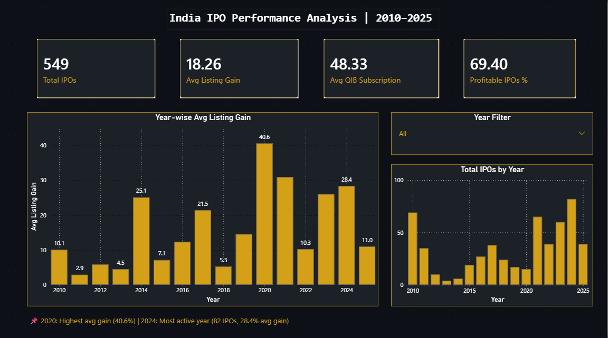
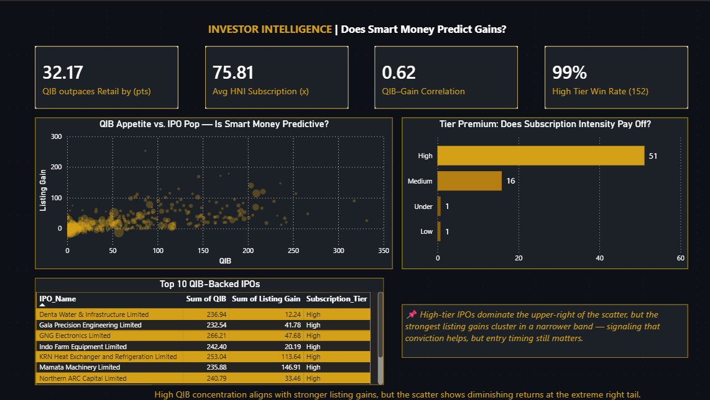
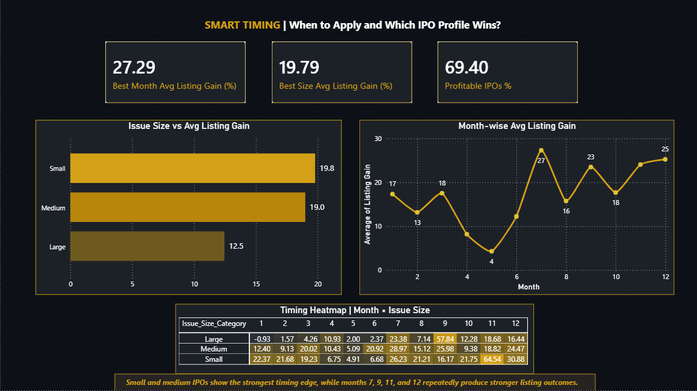
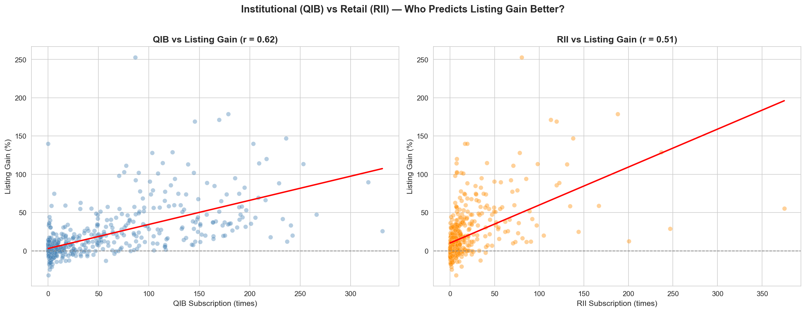

# 📈 India IPO Performance Analysis (2010–2025)

**Do institutional investors actually predict IPO winners? Does a strong listing day mean anything for long-term returns?**
This project answers both, using 549 Indian IPOs across Python EDA, Excel pivot dashboards, and a 3-page Power BI report.


---

## 🎯 TL;DR

| Question | Answer |
|---|---|
| Do most IPOs make money on listing day? | Yes — **69.4%** list above offer price |
| What's a "typical" listing gain? | **7.15%** median (not the 18.3% average — a few big winners skew it) |
| Best predictor of listing gain? | **QIB (institutional) subscription** — r = 0.62, beats retail (RII, r = 0.51) |
| Best IPO size to bet on? | **Small/Medium** (~19–20% avg gain) over Large (~12.5%) |
| Does a hot listing day predict long-term returns? | **No** — correlation is ~0.07, essentially zero |

---

## 📊 The Dashboard



*3-page Power BI report — Overview, Investor Intelligence ("does smart money predict gains?"), and Smart Timing ("when to apply, which profile wins").*

<details>
<summary><b>See all 3 dashboard pages</b></summary>

**Investor Intelligence — Is Smart Money Predictive?**


**Smart Timing — When to Apply & Which Profile Wins**


</details>

---

## 🔍 Key Findings

### Listing day performance
Most IPOs are clustered between 0% and 30% gain. Mean (18.3%) sits well above median (7.15%) — a handful of 200%+ blowouts pull the average up.


### Institutions vs. retail — who calls it better?
QIB subscription correlates with listing gain at **r = 0.62**; RII at **r = 0.51**. Institutional demand is the stronger signal, but neither guarantees a win — the scatter is wide either way.



- IPOs subscribed **50x+** averaged **51% gain** with a **99% hit rate**
- IPOs subscribed **1–10x** averaged just **0.7%**
- 50x swing in outcomes based on subscription tier alone

### Issue size: bigger isn't better (for listing day)
| Size | Avg Gain | Why |
|---|---|---|
| Small | 19.8% | Higher upside, higher downside risk |
| Medium | 19.0% | Sweet spot — QIB interest highest here |
| Large | 12.5% | Heavily covered/priced efficiently, less room to pop |

### Year-over-year
- **2020**: best avg gain (40.6%) on low volume (15 IPOs) — flight to quality during COVID
- **2024**: most active year ever (82 IPOs) *and* strong avg gain (28.4%) — genuinely hot market, not just volume
- Institutional participation grew ~4x (20x → 84x avg QIB) from 2010 to 2024–25

### Listing gain ≠ long-term return
Correlation between Day 1 gain and current gain: **0.07** — basically none. Some IPOs that flopped on listing day became long-term winners.
> ⚠️ Caveat: "current gains" is a snapshot, not annualized — a 2010 IPO has had 15 years to compound vs. months for a 2025 IPO. Treat this as directional, not a precise return comparison.

---

## 🛠️ Tools & Approach

| Stage | Tool | What happened |
|---|---|---|
| Cleaning | Python (Pandas) | Case-by-case null diagnosis (not blanket drops), type fixes, feature engineering |
| EDA | Python (Matplotlib/Seaborn) | 7 notebooks, one focused question each |
| Quick reference | Excel | Pivot tables + charts for fast lookups |
| Presentation | Power BI | Interactive 3-page report |

**Cleaning highlights** (`notebooks/01_data_cleaning.ipynb`):
- 561 → 549 IPOs after cleaning (2.1% data loss)
- Missing subscription data (2 rows: REIT + a company where it wasn't captured at source) → dropped with reasoning, not silently
- Missing NSE prices (10 rows) → dropped since cross-exchange comparison wasn't possible
- Missing BSE prices (2 rows) → filled from NSE where the stock trades on both exchanges
- Engineered: `Listing_Category`, `Issue_Size_Category`, `Subscription_Tier`, `QIB_vs_RII`

---

## 📁 Repo Structure

```
notebooks/    7 notebooks — cleaning → EDA, one question per notebook
data/         raw/ (original export) + cleaned/ (post-processing)
charts/       exported PNGs from the Python EDA
excel/        pivot workbook + screenshots
powerbi/      .pbix report + page screenshots
```

## ⚠️ Known Limitations

- Two rows (NSDL, Satchmo Holdings) show a large BSE/NSE price mismatch, likely a source data-entry error — flagged rather than silently corrected, since I can't verify which value is right.
- "Current gains" reflect a single snapshot in time, not annualized returns — see caveat above.